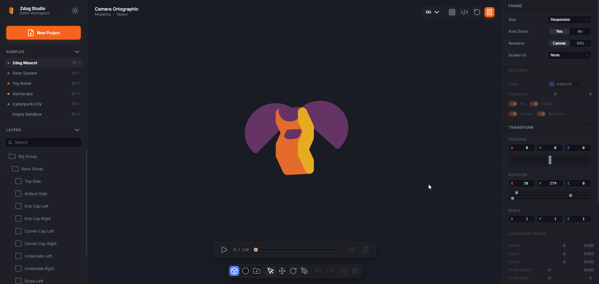

# Zdog Studio — Pseudo 3D Editor For Zdog

Visit [Zdog 3D Studio](https://zdogstudio.wasmer.app/)





Zdog Studio is a powerful, interactive, web-based 3D modeling and animation editor built on top of the popular **Zdog** pseudo-3D engine. It provides a visual interface for creating 3D meshes, 2D shapes, custom paths, keyframe animations, and exporting production-ready JavaScript code, SVG, or PNG scenes.

## Features

- **Interactive Modeling**: Click and drag to add, move, rotate, scale, clone, or delete 3D shapes (Box, Cylinder, Cone, Hemisphere) and 2D shapes (Ellipse, Rect, RoundedRect, Polygon).
- **Free-form Drawing (Pen Tool)**: Click directly on the viewport canvas to sketch custom shape paths and easily edit/close them.
- **Auto-Color Selection**: Every new shape or pen path automatically receives a distinct, vibrant color upon creation to distinguish items, customizable later in the sidebar.
- **Visual Keyframe Timeline**: Create motion tween keyframes across 120 frames to animate translation, rotation, and scaling of objects. Play, pause, or slide to inspect animations in real-time.
- **"Import JS" Code compiler**: Paste raw imperative Zdog JavaScript code from CodePen or other sources. The engine parses it into an editable, visual scene graph structure instantly.
- **Dynamic Re-compiling Code View**: View and copy/download clean, standalone ES6 JavaScript code as you modify the scene.
- **Exporting Options**: Export clean SVG files, high-resolution PNG images, or save/load your workspace using the native `.zd3d` project format.
- **Adaptive Dark/Light Theme**: Sleek Spline-style dark mode and a playful neo-brutalist light mode toggle.

## Getting Started

Simply open `index.html` in your browser, or spin up a local development server:

```bash
npx http-server
```

## Built With

- **HTML5 & CSS3**
- **Vanilla ES6 JavaScript**
- **Zdog engine** (by David DeSandro)
- **Lucide Icons**
